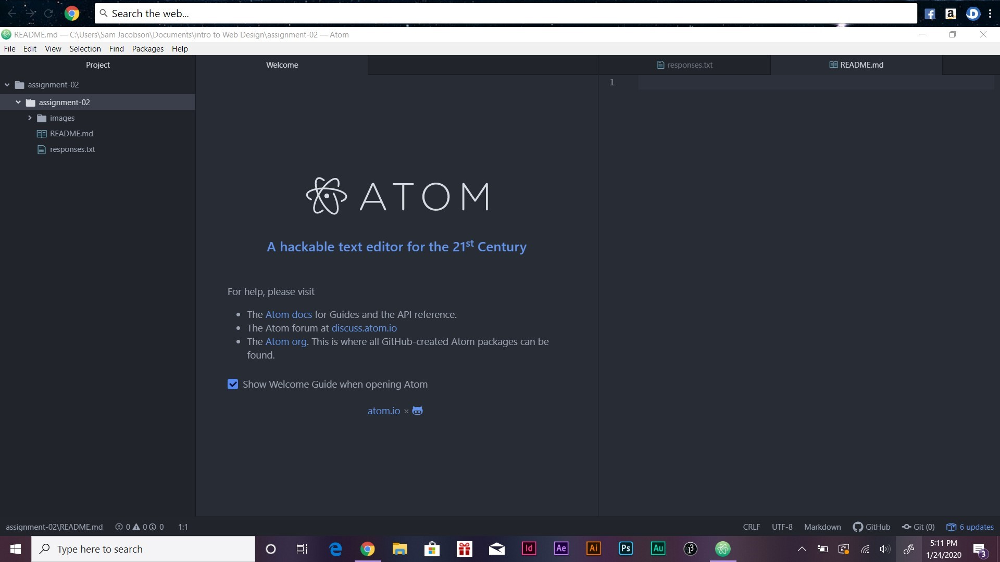

# Assignment 2
## Samantha Jacobson

The reason why I joined this class is because my major is Media Art. This class is a requirement for me to take. I am actually excited for this class because I have done web design before and it is fun being able to create your own websites. It gives you an idea on how websites are made.

1. I hope to learn new tags.
2. I want to learn how to create a more professional looking website.
3. I want to learn a basic structure of a website.

[YouTube](https://www.youtube.com/watch?v=U3cpdkhtGx0&list=PLw-VjHDlEOgsCOeBMp5fNPp52Sx6OHRjS&index=4)

[My Responses](./responses.txt)

