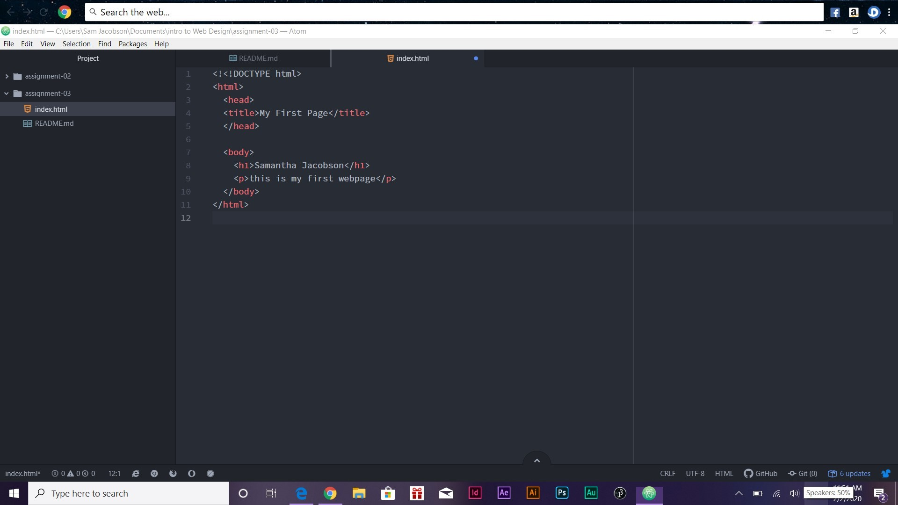

# Assignment 3
## Samantha Jacobson

- Browsers uses markup languages like html and other files to create a User interface, a rendering engine, and a browser engine. A user interface is what helps interact with what in on the screen. A rendering engine takes code from html or css to create the dispay on the screen. The browser engine directs things between the user interface and the rendering engine. A browser helps us connect to the internet.

I use Chrome the most. Once in awhile I will use Internet Explorer or Fire Fox.

- A markup language is a coding language that uses tags.

HTML is a commonly used markup language

