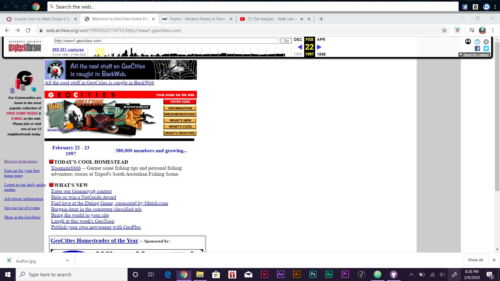

# Assignment 4
## Samantha Jacobson

I went to http://www1.geocities.com/. The page in 1997 was really messy. I had a hard time finding thing. The spacing was really close together. It started to get a little more cleaner up to about the end of 1997. Then they redid it and it got really messy in 1998. It was really confusing, at first I thought it was a website about different cities in the world. Then the more I kept going through the different years it turned into a website on how to make a free website and web hosting. It got cleaner as the years went by. The website shut down in 2010 probably because the website just did not look very appealing. It made it hard for them to sell anything. I learned that a messy website will not last long.

