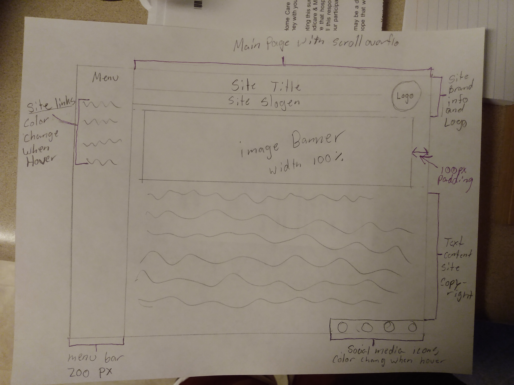

# Assigment 11
## Samantha Jacobson

-
   1. borders outline the inner content
   2. Margin is the space between the box element and other elements.
   3. Padding is the space betweenthe inner content.
- 
- I am not going to lie, this project was a pain in the but. I first drew out my sketch of my website that I wanted to do. I made an index.html, and a style.css. Then I put in the main and meta elements in the index. ThenI create divs for my title, slogen, banner, text, menu, logo and social media icons. I put in my title and slogen. I wanted to work on my menu because I though it would take he longest and it did. I spent a good 5 hours just trying to get my menu bar to work. I wanted to do a slide-out menu bar. I looked up videos and differnt website on how to it do it, but I just could not figure it out. I kept messing up. I end up changing my sketch and changing my slide-out bar to a regular side bar. I made classes that went with separate divs and styled everything in the style.css. I put where my logo would be by using the position, width, and height. I changed the margins so it would not look liked it is being stuck to the side of the screen. I used pseduo and pseduo-class to change the way the menu items, logos and social media icons would look like when you hover over them. I also embeded a couple of fonts.
